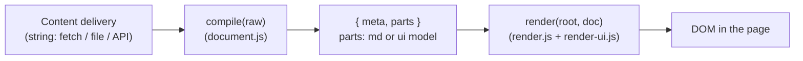

# md-frontend-framework

[](https://github.com/eSlider/md-frontend-framework/blob/main/LICENSE)
[](https://eSlider.github.io/md-frontend-framework/)
[](https://developer.mozilla.org/en-US/docs/Web/JavaScript/Guides/Modules)
[](package.json)
[](https://github.com/eSlider/md-frontend-framework#features)
[](https://github.com/eSlider/md-frontend-framework#features)

**[Live site (GitHub Pages)](https://eSlider.github.io/md-frontend-framework/)** ·
**[Repository](https://github.com/eSlider/md-frontend-framework)**

Experiment: **one markdown document** = YAML **frontmatter** + body with GitHub-Flavoured **Markdown** and **fenced `ui` blocks** (declarative form schema). The browser compiles the string to a small **view model** and the render layer maps that to the DOM. **Styling** stays in the host (CSS), not in author-controlled inline styles in content.

> **Repository “About” (copy-paste):** *Client-side MD + YAML: frontmatter, fenced `ui` blocks, compile→render contract. Zero backend, zero build, declarative-first. Vanilla ESM. Research prototype.*

## Features

These are *design* labels, not marketing absolutes—see the table for what they mean in this repo.

| Feature | What it means here |
|--------|---------------------|
| **Zero backend** | The **shipped** site is **static files** only. There is no app server, API, or database in the delivery path. A browser fetches `index.html`, `src/`, `content/`, and `pages.yml` from any static host (or GitHub Pages). |
| **Zero build** | **No** bundler, no `npm run build`, no compile step in CI for the app. The browser runs **ES modules** with an **`importmap`**; `npm run dev` is an optional local static server, not a pipeline. |
| **Zero [author] code** | **Authors** of pages do not write application code: they add **Markdown**, **YAML** (frontmatter + ` ```ui` blocks), and the **`pages.yml`** tree. You are not hand-writing React/Vue/TSX to ship a form or a nav entry. (The small **engine** in `src/*.js` is prewritten and shared.) |
| **Declarative-first** | The **source of truth** is **data**: fence blocks describe UI; `pages.yml` describes the **site map**; forms use `type`, `items`, and HTML-like `action` / `method`—**declare** what you need, the runtime maps it to the DOM. |

**What this is *not*:** a claim that the repository contains *no* JavaScript (the engine is JS), or that you should run untrusted markdown without sanitization—see [Security note](#security-note).

---

## Table of contents

- [Features](#features)
- [Why this exists (research)](#why-this-exists-research)
- [What it is (and is not)](#what-it-is-and-is-not)
- [Architecture: the contract](#architecture-the-contract)
- [Run locally](#run-locally)
- [Site map: `pages.yml` and routing](#site-map-pagesyml-and-routing)
- [GitHub Pages: Actions workflow (new default)](#github-pages-actions-workflow-new-default)
- [Security note](#security-note)
- [License](#license)

---

## Why this exists (research)

The original question was: can we treat **content** as a portable **contract** (a string) and the **view** as a replaceable **engine**—without pulling in a whole framework stack for every small doc+form use case?

Along the way we **compared and rejected** a few common directions, not because they are “bad” in general, but because they were the wrong cost for a **minimal, transparent** research sketch:

| Direction | What we wanted instead |
|-----------|------------------------|
| **TypeScript + `.mjs` layers + heavy adapters** | Plain **`.js` ES modules**; a single obvious pipeline |
| **React/MDX-style bundles** for every experiment | **Zero build** in the repo: `importmap` + browser `fetch` |
| **Optional second renderer** (e.g. Vue + UI kit via `import()`) in the same app | **One DOM path**; fewer MIME / SPA / CDN failure modes to debug |
| **Three vague “services” in the app** (parse, normalize, mount as disconnected concepts) | **Two clear steps:** `compile(raw)` and `render(container, doc)` plus one UIBlock renderer |

**Design rule:** the **content service** (CMS, `fetch`, or static `content/example.md`) is only responsible for **delivering a string**. Everything else is **compile** (to `{ meta, parts }`) and **render** (to DOM). That is the *declaration* in code.

---

## What it is (and is not)

**Is:**

- A **sketch** you can read in an afternoon: `src/document.js` (parse + GFM + fenced `ui`/`yaml`), `src/render.js`, `src/render-ui.js`.
- A **portable** format: frontmatter + MD + ` ```ui` blocks.
- A **form model** in YAML: root `type: form` with `action` / `method` like HTML, and recursive **`items`**.

**Is not:**

- A production headless CMS, a design system, or a markdown sanitizer.
- A promise of Vite/Webpack/SSR—**no build step** is intentional.

---

## Architecture: the contract



- **`parts`** are either pre-rendered markdown **HTML** (`{ type: 'md', html }`) or a **UI model** (`{ type: 'ui', data }` with normalised `items` for forms).
- **Theming** lives in your CSS (`src/app.css` in the demo), not in author-controlled `style` attributes from YAML.

---

## Run locally

`file://` does not load ES modules the way you need; use any static HTTP server. This repo includes a tiny one:

```bash
git clone https://github.com/eSlider/md-frontend-framework.git
cd md-frontend-framework
npm run dev
# → http://127.0.0.1:3456/
```

Dependencies are loaded from a CDN via **`importmap`** in `index.html` ([`marked`](https://github.com/markedjs/marked), [`yaml`](https://github.com/eemeli/yaml)). No `npm install` of those for the **browser** path.

---

## Site map: `pages.yml` and routing

A **`pages.yml`** in the [same folder as `index.html`](pages.yml) describes a **nav tree** for the whole static “site”: titles, optional `path` to a markdown file, and nested **`items`**. The app **fetches** that file; if the response is not OK, the app falls back to **no sidebar** and still serves markdown. **Deep links** use a **URL hash** such as `#content/example` (no `.md` in the bar) → the runtime loads `content/example.md` relative to the app root. Legacy `?path=` URLs are one-off redirected to the hash form.

**Relative assets:** `index.html` loads **`./src/main.js`** and **`./src/app.css`**, so the app works on **GitHub Pages** (e.g. `https://user.github.io/repo-name/`) and locally. The hash is resolved against the *current* page, not the web host’s domain root.

- **`default_path`** (optional) — which markdown file to use when the URL has **no hash** (if omitted, the first `path` in a depth-first walk is used, then `content/example.md` as a last resort).
- **`path`** in YAML (per node) is still the **on-disk** path, **relative to the app base** (e.g. `content/specs.md` — the hash is `#content/specs`). Fetches use `import.meta.url` from `src/`, so they work under a project subpath on GitHub Pages.

Layout: [`src/main.js`](src/main.js) loads the tree, [`src/site-nav.js`](src/site-nav.js) parses YAML and builds the **nested `<nav>`**; the left column is hidden when `pages.yml` is missing or empty.

### Supported root shapes in YAML

| Shape | Use |
|-------|-----|
| A **top-level array** | List of nav groups / links |
| An object with **`nav`**, **`items`**, or `pages` | Wrap the array and optional `default_path` / `defaultPath` |

The parser lives in `parsePagesYmlText` in `site-nav.js`.

---

## GitHub Pages: Actions workflow (new default)

This repo uses the **current** GitHub Pages model: **deploy from a GitHub Actions workflow** (artifact), not only “**Deploy from a branch**”. That gives you a clear build step (here: **package** static files) and the [standard `actions/deploy-pages`](https://github.com/actions/deploy-pages) path.

| Piece | Role |
|------|------|
| [`.github/workflows/deploy-gh-pages.yml`](.github/workflows/deploy-gh-pages.yml) | On `push` to `main`, copies `index.html`, `.nojekyll`, `pages.yml`, `content/`, `src/` into `_site/`, **uploads** the artifact, **deploys** to Pages. **No** Jekyll, **no** bundler—just a static tree. |
| **`.nojekyll`** | Still present: if you ever switch to “branch & root” deploy, it stops Jekyll from processing this non-Jekyll site. |
| **Settings** | **Settings** → **Pages** → **Build and deployment** → set **Source** to **GitHub Actions** (not “Deploy from a branch”) so this workflow is the one that publishes. If the repo previously used **branch** deploy, switch the source once to avoid two competing configs. |
| **URL** | Project site: **`https://<user>.github.io/<repo>/`** — e.g. **[`https://eSlider.github.io/md-frontend-framework/`](https://eSlider.github.io/md-frontend-framework/)** |

The published site only needs the files the browser loads; the workflow **does not** copy `dev-server.js`, `README`, or `.github` into the artifact, keeping the deploy small and aligned with *zero-build* / *static* delivery.

**First visit after a deploy** can briefly show **404** while Pages updates; refresh after a minute if needed. **Custom domain:** [GitHub docs](https://docs.github.com/en/pages/configuring-a-custom-domain-for-your-github-pages-site).

**Alternatives:** The same `index.html` + `src` + `content` tree can be served from any static host (S3+CloudFront, Netlify, etc.) without this workflow.

---

## Security note

`marked` output is assigned with **`innerHTML`**. For **untrusted** markdown, run a **sanitizer** (e.g. DOMPurify) before insert, or a safe markdown pipeline. This repository is a **toy** and does not ship that hardening.

---

## License

[MIT](LICENSE). By default **copyright 2026 eSlider**; change the `LICENSE` header if you fork under another entity.

## Topics (for GitHub search)

Suggested repository topics: `markdown`, `yaml`, `es-modules`, `static-site`, `github-pages`, `github-actions`, `form`, `research`, `no-build`, `declarative`, `frontend`.
