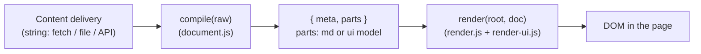

# md-frontend-framework

[](https://github.com/eSlider/md-frontend-framework/blob/main/LICENSE)
[](https://eSlider.github.io/md-frontend-framework/)
[](https://developer.mozilla.org/en-US/docs/Web/JavaScript/Guides/Modules)
[](package.json)

**[Live site (GitHub Pages)](https://eSlider.github.io/md-frontend-framework/)** ·
**[Repository](https://github.com/eSlider/md-frontend-framework)**

Experiment: **one markdown document** = YAML **frontmatter** + body with GitHub-Flavoured **Markdown** and **fenced `ui` blocks** (declarative form schema). The browser compiles the string to a small **view model** and the render layer maps that to the DOM. **Styling** stays in the host (CSS), not in author-controlled inline styles in content.

> **Repository “About” (copy-paste):** *Client-side MD + YAML: frontmatter, fenced `ui` blocks, compile→render contract. Vanilla ESM, no bundle. Research prototype.*

---

## Table of contents

- [Why this exists (research)](#why-this-exists-research)
- [What it is (and is not)](#what-it-is-and-is-not)
- [Architecture: the contract](#architecture-the-contract)
- [Run locally](#run-locally)
- [Site map: `pages.yml` and routing](#site-map-pagesyml-and-routing)
- [GitHub Pages: static, no Jekyll, no Action](#github-pages-static-no-jekyll-no-action)
- [Security note](#security-note)
- [License](#license)

---

## Why this exists (research)

The original question was: can we treat **content** as a portable **contract** (a string) and the **view** as a replaceable **engine**—without pulling in a whole framework stack for every small doc+form use case?

Along the way we **compared and rejected** a few common directions, not because they are “bad” in general, but because they were the wrong cost for a **minimal, transparent** research sketch:

| Direction | What we wanted instead |
|-----------|------------------------|
| **TypeScript + `.mjs` layers + heavy adapters** | Plain **`.js` ES modules**; a single obvious pipeline |
| **React/MDX-style bundles** for every experiment | **Zero build** in the repo: `importmap` + browser `fetch` |
| **Optional second renderer** (e.g. Vue + UI kit via `import()`) in the same app | **One DOM path**; fewer MIME / SPA / CDN failure modes to debug |
| **Three vague “services” in the app** (parse, normalize, mount as disconnected concepts) | **Two clear steps:** `compile(raw)` and `render(container, doc)` plus one UIBlock renderer |

**Design rule:** the **content service** (CMS, `fetch`, or static `content/example.md`) is only responsible for **delivering a string**. Everything else is **compile** (to `{ meta, parts }`) and **render** (to DOM). That is the *declaration* in code.

---

## What it is (and is not)

**Is:**

- A **sketch** you can read in an afternoon: `src/document.js` (parse + GFM + fenced `ui`/`yaml`), `src/render.js`, `src/render-ui.js`.
- A **portable** format: frontmatter + MD + ` ```ui` blocks.
- A **form model** in YAML: root `type: form` with `action` / `method` like HTML, and recursive **`items`**.

**Is not:**

- A production headless CMS, a design system, or a markdown sanitizer.
- A promise of Vite/Webpack/SSR—**no build step** is intentional.

---

## Architecture: the contract



- **`parts`** are either pre-rendered markdown **HTML** (`{ type: 'md', html }`) or a **UI model** (`{ type: 'ui', data }` with normalised `items` for forms).
- **Theming** lives in your CSS (`src/app.css` in the demo), not in author-controlled `style` attributes from YAML.

---

## Run locally

`file://` does not load ES modules the way you need; use any static HTTP server. This repo includes a tiny one:

```bash
git clone https://github.com/eSlider/md-frontend-framework.git
cd md-frontend-framework
npm run dev
# → http://127.0.0.1:3456/
```

Dependencies are loaded from a CDN via **`importmap`** in `index.html` ([`marked`](https://github.com/markedjs/marked), [`yaml`](https://github.com/eemeli/yaml)). No `npm install` of those for the **browser** path.

---

## Site map: `pages.yml` and routing

A **`pages.yml`** in the [same folder as `index.html`](pages.yml) describes a **nav tree** for the whole static “site”: titles, optional `path` to a markdown file, and nested **`items`**. The app **fetches** that file; if the response is not OK, the app falls back to **no sidebar** and still serves markdown via `?path=`.

**Relative URLs only (no domain-root `/` paths):** `index.html` loads **`./src/main.js`** and **`./src/app.css`**, so the app works on **GitHub Pages** (e.g. `https://user.github.io/repo-name/`) as well as locally. Nav and `history` use a **query-only** href (`?path=…`, resolved for the *current* document path), not `/?path=` at the **site** root of the host.

- **`default_path`** (optional) — which markdown file to use when the URL has no `path` query (if omitted, the first `path` in a depth-first walk is used, then `content/example.md` as a last resort).
- **`path`** on a node is **relative to the app base** (folder that contains `index.html` and `pages.yml`, same layout as the repo in this project). Use forward slashes, **no** leading `/` (e.g. `content/specs.md`, not `/content/specs.md`). Fetches use `import.meta.url` so they work under a project subpath.

Layout: [`src/main.js`](src/main.js) loads the tree, [`src/site-nav.js`](src/site-nav.js) parses YAML and builds the **nested `<nav>`**; the left column is hidden when `pages.yml` is missing or empty.

### Supported root shapes in YAML

| Shape | Use |
|-------|-----|
| A **top-level array** | List of nav groups / links |
| An object with **`nav`**, **`items`**, or `pages` | Wrap the array and optional `default_path` / `defaultPath` |

The parser lives in `parsePagesYmlText` in `site-nav.js`.

---

## GitHub Pages: static, no Jekyll, no Action

This project is a **static site** (HTML, CSS, JS) served **as files**. There is **no** Jekyll or Eleventy build, and **no** required GitHub Actions workflow.

1. In the repository: a **`.nojekyll`** file in the publishing root so GitHub **does not** run the default [Jekyll](https://jekyllrb.com/) step on your static files. This repo is not a Jekyll site; skipping the generator keeps `index.html` and ES modules exactly as in Git.
2. **Settings** → **Pages** → **Build and deployment** → **Deploy from a branch** → `main` → **/ (root)**.  
3. The site URL is: **`https://<user>.github.io/<repo>/`**  
   - This repo: **[`https://eSlider.github.io/md-frontend-framework/`](https://eSlider.github.io/md-frontend-framework/)**  
4. `fetch` uses relative URLs from `import.meta.url`; they work under the `/<repo>/` base path the same as locally. The first time you open the Pages URL, GitHub may return **404** for a short period while the static export updates; try again in one or two minutes.

*Optional:* add a [custom domain](https://docs.github.com/en/pages/configuring-a-custom-domain-for-your-github-pages-site) in **Settings** → **Pages** if you use your own host.

You can also host the same files on any static host (S3+CloudFront, Netlify, etc.); the README section above is GitHub-specific for **Jekyll off** and **branch deploy**.

---

## Security note

`marked` output is assigned with **`innerHTML`**. For **untrusted** markdown, run a **sanitizer** (e.g. DOMPurify) before insert, or a safe markdown pipeline. This repository is a **toy** and does not ship that hardening.

---

## License

[MIT](LICENSE). By default **copyright 2026 eSlider**; change the `LICENSE` header if you fork under another entity.

## Topics (for GitHub search)

Suggested repository topics: `markdown`, `yaml`, `es-modules`, `static-site`, `github-pages`, `form`, `research`, `no-build`, `frontend`.
