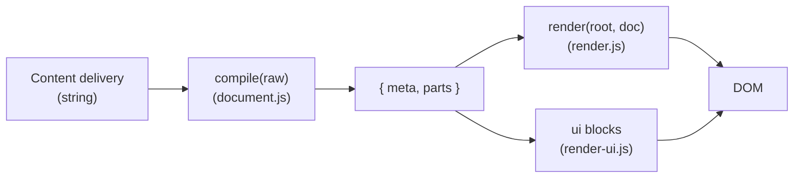

# Architecture

[← yamd manual](#docs/index)

## Data flow



- **`parts`:** either Markdown as HTML (`{ type: 'md', html }`) or a **UI model** (`{ type: 'ui', data }`) from fenced ` ```ui` / yaml fences.
- **Theming** lives in **host CSS** (e.g. `src/app.css`), not author inline `style` in YAML.

## Main modules (under `src/`)

| File | Role |
|------|------|
| `document.js` | Frontmatter, fence split, `marked` for body, `compile` output |
| `render.js` | Puts `parts` into the article: sections + `render-ui.js` for UI |
| `render-ui.js` | Declarative YAML form → DOM (inputs, `type: form`, nested `items`) |
| `site-nav.js` | `pages.yml`, hash ↔ path, left nav; used from `main.js` |
| `main.js` | Fetch `pages.yml` + markdown, routing (`hashchange` / `popstate`, legacy `?path=` once) |

Source: repo [`src/`](https://github.com/eSlider/yamd/tree/main/src) (not served as a directory index on the static site).

**Related:** [Site map & routing](#docs/site-map) · [Get started](#docs/get-started) · [Specs](#specs)
